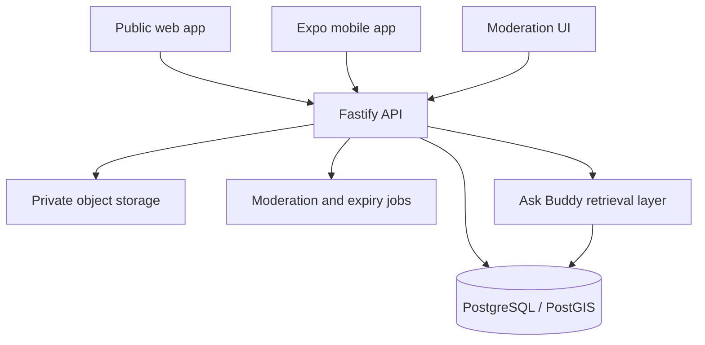

# Architecture

## System boundary

Travel Buddy Reach is a standalone TypeScript monorepo. The web and mobile clients consume the same versioned API and shared contracts. PostgreSQL is the source of truth; object storage will hold user photographs and privacy-scrubbed route media.

## Main domains

| Domain | Responsibility |
| --- | --- |
| Identity | Accounts, sessions, roles, blocking, language preferences |
| Places | Destination identity, sensitive-place reveal policy, facilities |
| Access | Ordered access graph, vehicle suitability, landmarks, parking, walking |
| Evidence | Verified journeys, condition reports, freshness, confidence calculation |
| Assessment | Vehicle Passport comparison and explainable `Can I Go?` outcome |
| Community | Reviews, questions, guardian confirmations, reporting |
| Moderation | Queues, expiry, content decisions, immutable audit history |
| Ask Buddy | Retrieval, source classification, multilingual response composition |

## Journey Confidence Score

The stored score is a cache, not the source of truth. A scheduled worker recalculates it from recent approved evidence. A production formula should be calibrated with field data, but the initial weights can be:

- 35% recency-weighted verified journeys
- 20% agreement between independent reports
- 15% contributor reliability
- 10% recent vehicle-specific confirmations
- 10% official-source freshness
- 10% destination status certainty

Evidence decays exponentially. Reports past their explicit expiry are excluded from active status and retained only for audit/history.

## API evolution

- Prefix public endpoints with `/v1`.
- Use shared Zod contracts at every untrusted boundary.
- Additive fields are allowed inside a version; breaking changes require `/v2`.
- Store timestamps in UTC and render them in the traveller's locale.
- Use opaque IDs publicly; never reveal user journey identifiers as location history.

## Production additions

Before launch, add an authentication provider, Redis-backed queues and rate limiting, S3-compatible media storage, map tile provider, OpenTelemetry, error monitoring, database backups, and separate staging/production environments.

